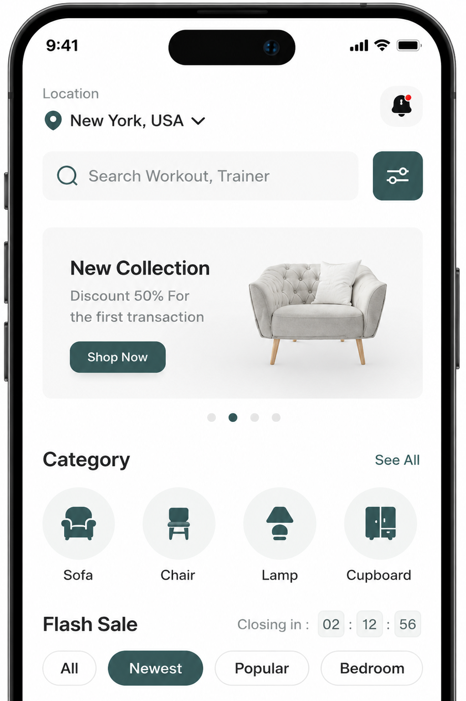
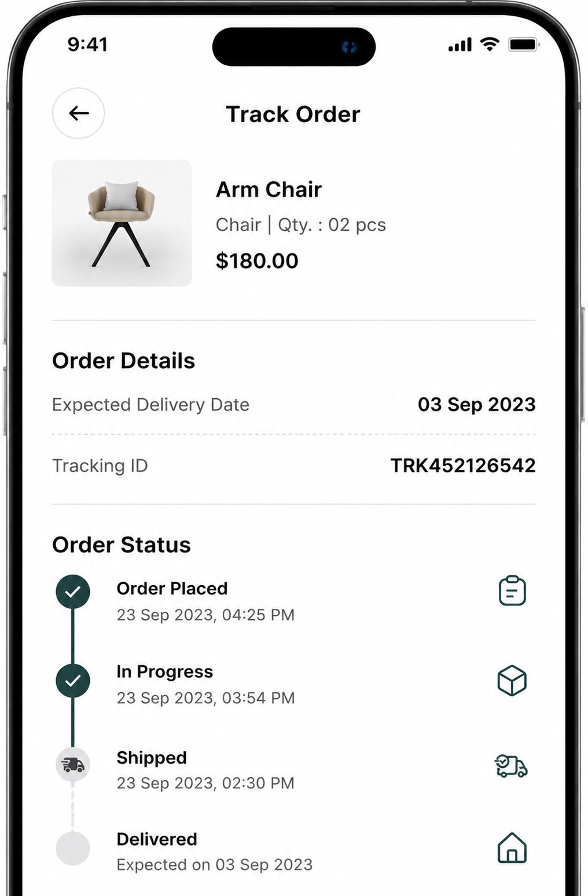
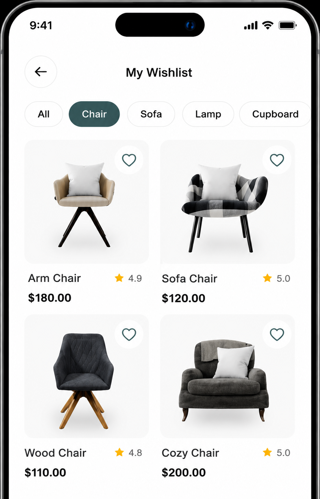

<div align="center">
  
  <h1 style="color: #0277BD;">🛋️ Furniture App</h1>
  <p><i>Aplikasi E-commerce Furniture Modern berbasis Flutter</i></p>
  
  <!-- Badges -->
  
  
  
  
  
  <br/>
  
  
  
</div>

---

## 📱 **Tentang Aplikasi**

**Furniture App** adalah aplikasi e-commerce yang dirancang khusus untuk memenuhi kebutuhan furniture modern. Aplikasi ini memungkinkan pengguna untuk menjelajahi berbagai koleksi furniture, melakukan pembelian, melacak pesanan, dan terhubung langsung dengan penjual.

### 🎯 **Latar Belakang**

Aplikasi ini dikembangkan sebagai **Proyek Akhir** dalam pengembangan aplikasi berbasis Android menggunakan Flutter. Tujuannya adalah menciptakan platform belanja furniture yang seamless, user-friendly, dan terintegrasi dengan baik.

---

## 👥 **Tim Pengembang**

| Peran | Nama | Kontribusi |
|-------|------|-------------|
| 💻 **Programmer** | **Wahyu Ravi Anggoro** | Pengembangan full-stack Flutter, implementasi UI/UX, logika bisnis, integrasi API, state management, dan deployment |
| 🎨 **UI/UX Designer** | **Burhan** | Desain antarmuka pengguna di Figma, wireframing, prototyping, user flow, dan design system |
| 🔧 **Backend Developer** | **Bintang** | Pengembangan dan manajemen API menggunakan Mockoon, endpoint design, data modeling, dan dokumentasi API |

### **Kolaborasi Tim**
┌─────────────────┐ ┌─────────────────┐ ┌─────────────────┐
│ 🎨 BURHAN │────▶│ 💻 WAHYU │────▶│ 🔧 BINTANG │
│ UI/UX Design │ │ Flutter Dev │ │ API Mockoon │
│ (Figma) │ │ (Frontend) │ │ (Backend) │
└─────────────────┘ └─────────────────┘ └─────────────────┘
│ │ │
▼ ▼ ▼
Desain Mockup Implementasi Kode Endpoint API
Prototype State Management Data Response
Asset Export Integrasi API Dokumentasi

---

## 🎨 **Desain Aplikasi (Figma by Burhan)**

Berikut adalah hasil desain UI/UX yang dibuat oleh **Burhan** menggunakan Figma:

### **📱 Halaman Utama**

<div align="center">
  
  
  
</div>

> *Tampilan onboarding yang menarik dengan visual furniture yang elegan*

### **✨ Fitur Unggulan**

<div align="center">

| **Get the Best Furniture Deals** | **Furnisher: Details & Stylish Styles** |
|:-------------------------------:|:----------------------------------------:|
| Discover the perfect balance between savings and style! | Dive into the finer details of each product |

| **Save Your Favorites** | **Effortless Shopping Experience** |
|:----------------------:|:----------------------------------:|
| Curate your very own furniture haven effortlessly | Simplify your shopping journey |

| **Stay Updated on Your Orders** | **Connect with Furniture Experts** |
|:------------------------------:|:----------------------------------:|
| Stay connected with order status at every step | Direct chat with shop owner |

</div>

---

## 🛠️ **Teknologi yang Digunakan**

### **Frontend (Wahyu)**
```yaml
Framework:  Flutter 3.16+
Language:   Dart 3.2+
State Management: Provider
Navigation: GetX / Navigator 2.0
HTTP Client: Dio
Local Storage: Shared Preferences
UI Components: Material 3 Design

Design Tool: Figma
Asset Creation: Adobe Illustrator
Prototyping: Figma Mirror
Design System: Custom Components
Color Palette: Earth Tones + Modern Accent


API Tool: Mockoon
Endpoints: RESTful API
Data Format: JSON
Base URL: http://localhost:3000
Endpoints Created: 
  - /api/products
  - /api/categories
  - /api/cart
  - /api/orders
  - /api/user
  - /api/auth

📂 Arsitektur Aplikasi
lib/
├── screens/              # 20+ Halaman UI
│   ├── onboarding_screen.dart
│   ├── login_screen.dart
│   ├── home_screen.dart
│   ├── cart_screen.dart
│   ├── checkout_screen.dart
│   ├── profile_screen.dart
│   ├── product_detail_screen.dart
│   └── ...
├── providers/            # State Management
│   ├── auth_provider.dart
│   ├── cart_provider.dart
│   ├── product_provider.dart
│   └── checkout_provider.dart
├── services/             # API Services (Modular)
│   ├── api_client.dart   # HTTP client wrapper
│   ├── api_config.dart   # Endpoint configuration
│   ├── auth_service.dart
│   ├── cart_service.dart
│   ├── product_service.dart
│   ├── order_service.dart
│   └── user_service.dart
├── models/               # Data Models
│   ├── product.dart
│   ├── category.dart
│   ├── cart.dart
│   └── order.dart
├── widgets/              # Reusable Components
└── utils/                # Helper Functions

🚀 Fitur Lengkap Aplikasi
👤 Autentikasi & Profil
✅ Login / Register pengguna

✅ Edit profil dan alamat

✅ Privacy policy & settings

🛍️ Belanja
✅ Katalog produk dengan kategori (Sofa, Chair, Lamp, Cupboard)

✅ Detail produk lengkap

✅ Flash sale & diskon

🛒 Keranjang & Checkout
✅ Manajemen keranjang belanja

✅ Pilih metode pengiriman

✅ Pilih metode pembayaran

✅ Kupon diskon (tersedia/terkunci)

✅ Ringkasan pesanan (Sub-total + Delivery fee - Discount = Total)

📦 Tracking Order
✅ Lacak status pesanan real-time

✅ Timeline pesanan:

Online Place (23 Sep 2023, 04:15 PM)

In Progress (23 Sep 2023, 05:14 PM)

Shipped (23 Sep 2023, 06:15 PM)

Delivered (23 Sep 2023, 07:15 PM)

✅ Tracking ID dan estimasi pengiriman

💬 Komunikasi
✅ Chat dengan pemilik toko (direct conversation)

✅ Help center & support

🎨 UI/UX Premium
✅ Desain modern dengan Material 3

✅ Animasi halus

✅ Responsif untuk berbagai ukuran layar

✅ Dark mode support

💻 Cara Menjalankan Proyek
Prasyarat
# 1. Flutter SDK (≥3.16)
https://flutter.dev/docs/get-started/install

# 2. Android Studio / VS Code
# 3. Emulator Android atau device fisik
Langkah Instalasi
# 1. Clone repository
git clone https://github.com/WagyuuA5/Furniture_App.git

# 2. Masuk ke folder project
cd Furniture_App

# 3. Install dependencies
flutter pub get

# 4. Jalankan aplikasi
flutter run

# 5. Build APK (untuk produksi)
flutter build apk --release

Konfigurasi API (Mockoon)
# 1. Install Mockoon dari https://mockoon.com/
# 2. Import file JSON environment (dari Bintang)
# 3. Jalankan Mockoon di port 3000
# 4. Aplikasi akan terhubung otomatis ke API

📊 Demo Aplikasi
Splash_Screen → Onboarding → Login/Register → Browse Products → Add to Cart → 
Checkout → Payment → Track Order → Chat Seller → Receive Product.

Contoh Transaksi
Item	Harga
Amir Chahal - Sofa	$160.00
Sub-Total	$160.00
Delivery Fee	$10.00
Discount (Kupon)	-$20.00
Total Cost	$150.00

🔄 Status Perkembangan
Modul	Progress	Status
Onboarding	100%	✅ Selesai
Autentikasi	100%	✅ Selesai
Katalog Produk	100%	✅ Selesai
Keranjang	100%	✅ Selesai
Checkout	100%	✅ Selesai
Pembayaran	100%	✅ Selesai
Tracking Order	100%	✅ Selesai
Chat	100%	✅ Selesai
Profil & Settings	100%	✅ Selesai
Dokumentasi	100%	✅ Selesai
Keseluruhan Proyek: 100% Complete! 🎉

📸 Screenshots Aplikasi


🏆 Pencapaian Proyek
✅ Aplikasi Flutter pertama yang selesai dengan fitur lengkap

✅ Kolaborasi tim 3 orang (programmer + desainer + backend)

✅ Desain Figma profesional oleh Burhan

✅ API Mockoon terintegrasi oleh Bintang

✅ Codebase modular dengan service layer terpisah

✅ State management dengan Provider

✅ 20+ screen dengan navigasi lengkap

✅ Siap rilis ke Google Play Store

📝 Kesimpulan
Furniture App adalah bukti nyata kolaborasi sukses antara programmer, desainer, dan backend developer. Aplikasi ini tidak hanya memenuhi kebutuhan fungsional e-commerce furniture tetapi juga memberikan pengalaman pengguna yang premium melalui desain yang indah (Burhan), performa yang optimal (Wahyu), dan backend yang reliable (Bintang).

Proyek ini menjadi portfolio berharga bagi ketiga anggota tim dalam mengembangkan aplikasi berbasis Flutter siap produksi.

📞 Kontak Tim
Anggota	Peran	GitHub	Email
Wahyu Ravi Anggoro	Programmer	@WagyuuA5	[whyuravi.2008@gmail.com]
Burhan	UI/UX Designer	[username GitHub]	[isi email]
Bintang	Backend Developer	[username GitHub]	[isi email]

📄 Lisensi
Proyek ini dilisensikan di bawah MIT License - lihat file LICENSE untuk detail.

<div align="center"> <br/> <sub>Built with ❤️ using Flutter by Tim Furniture App</sub> <br/>    <br/> <b>Furniture App - Proyek Akhir</b><br/> <i>Discover the perfect balance between savings and style!</i> </div> ```

📤 Cara Upload README ke GitHub
# 1. Simpan kode di atas ke file README.md (di root project)

# 2. Tambahkan ke Git
git add README.md

# 3. Commit
git commit -m "Add professional README with team documentation"

# 4. Push ke GitHub
git push origin main

